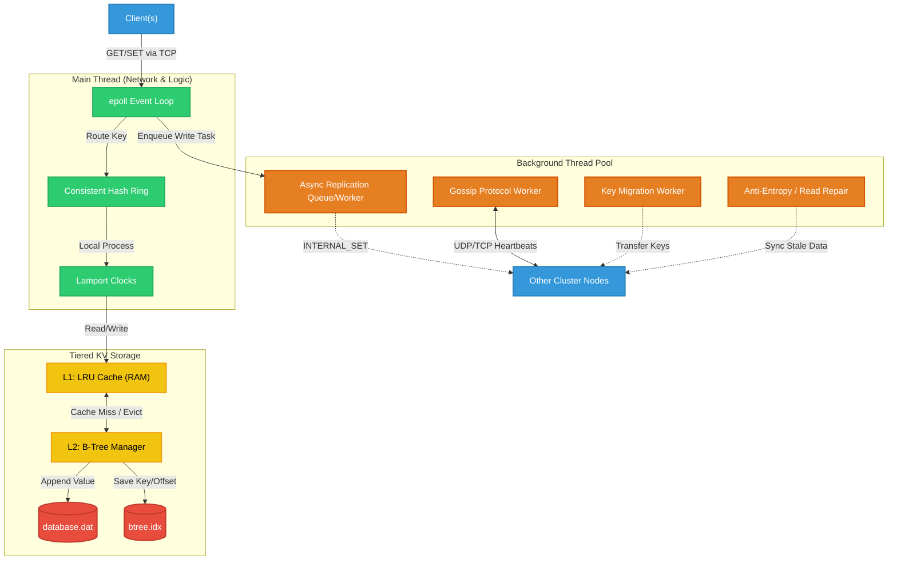

# NitKVStore: Complete Architecture and Components

This document outlines the core components of the current NitKVStore system and provides a unified architecture diagram showing how they all fit together to deliver a high-performance, distributed, and eventually consistent database.

## Core Components

### 1. Network & Routing Layer
* **`epoll` Event Loop:** The heart of the node. A single-threaded event loop that handles thousands of concurrent TCP connections efficiently using non-blocking I/O.
* **Consistent Hash Ring:** Routes requests. It maps keys to specific nodes in the cluster using virtual nodes, ensuring an even distribution of data.

### 2. Tiered Storage Engine (KVStore)
* **L1: LRU Cache (RAM):** A fast in-memory cache implemented with a hash map and a doubly-linked list. It handles `O(1)` reads and writes and evicts the least recently used items when full.
* **L2: B-Tree Storage (Disk):** A custom Order-3 B-Tree. When the RAM cache is full or for durability, data is stored persistently. 
  * `database.dat`: Appends raw values.
  * `btree.idx`: Stores the keys and file offsets.

### 3. Distributed Cluster Management
* **Gossip Protocol:** A background thread that continuously exchanges heartbeats with other nodes. It handles decentralized peer discovery and automatic failure detection if a node stops responding.
* **Lamport Clocks:** Logical clocks attached to key-value pairs that help resolve write conflicts ("last-write-wins") across the distributed system.

### 4. Background Workers (Eventual Consistency & Fault Tolerance)
* **Async Replication Worker:** Pulls write operations from a thread-safe queue and asynchronously sends them to backup nodes (replicas) to ensure high availability.
* **Key Migration Worker:** Triggers when nodes join or leave the cluster. It moves keys around so they live on the correct owner according to the Hash Ring.
* **Read Repair / Anti-Entropy Worker:** Periodically checks with replicas or triggers on read to fix stale data and ensure all nodes eventually converge on the same state.

---

## Overall Architecture Diagram

The diagram below maps out how a single node operates internally and communicates externally with clients and the rest of the cluster.

