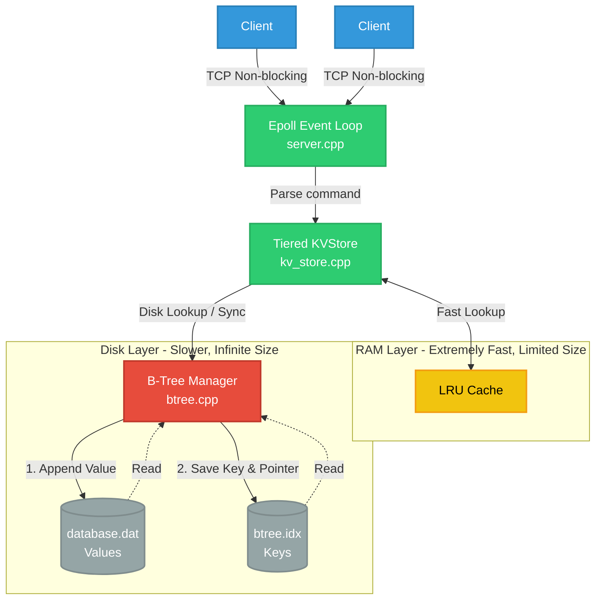
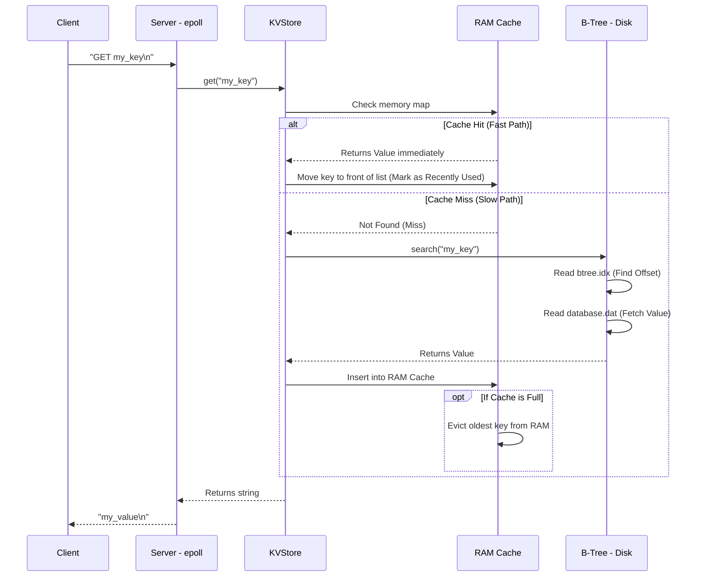
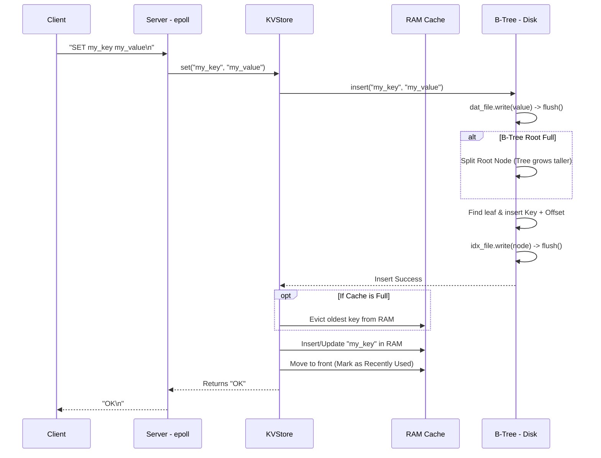

# NitKVStore Architecture

Below are detailed architectural diagrams that visualize exactly how the system is structured and how data flows through it. 

### 1. High-Level Component Architecture
This diagram shows how the different parts of the system interact, from the network layer down to the physical hard drive.

---

### 2. Request Flow: The `GET` Operation
This sequence diagram shows the exact step-by-step logic when a client asks for a key. Notice how the database falls back to the hard drive only if the RAM fails (Cache Miss).

---

### 3. Request Flow: The `SET` Operation
This sequence diagram shows what happens when data is written. Notice that data is **always** written to the hard drive first to guarantee durability (so we don't lose it if the server crashes).

