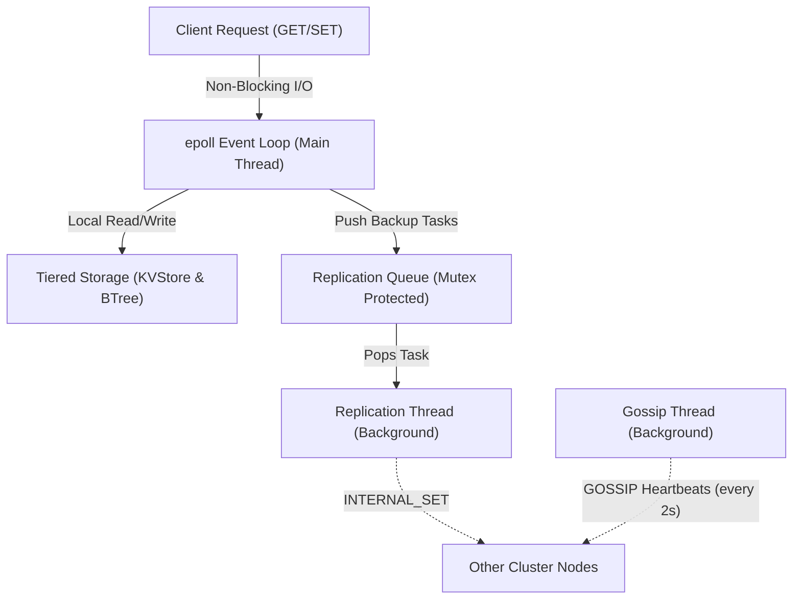
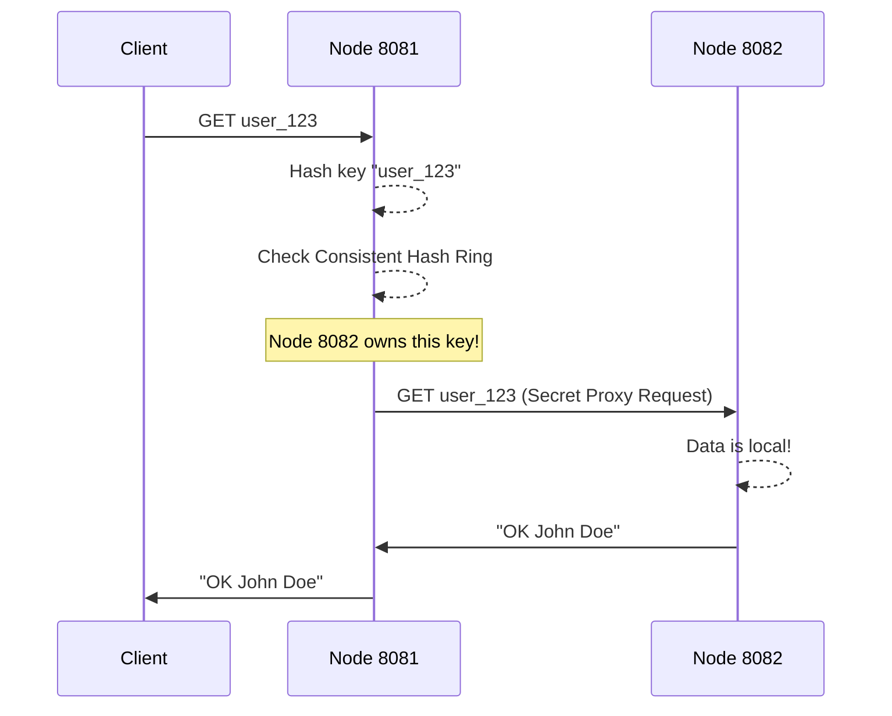
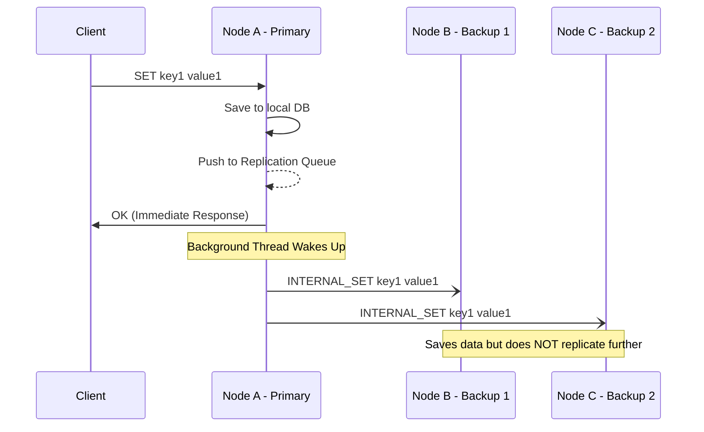
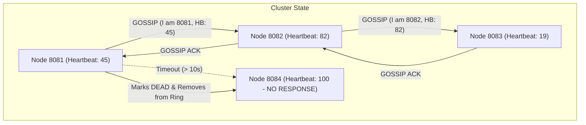

# Architecture Diagrams

Here are simple, visual explanations of the architecture we built over the three phases. You can use these to quickly explain how the system works to others.

## 1. Single Node Internal Architecture
This diagram shows what happens inside a single server. Notice how the main `epoll` thread handles the fast work, while the heavy network lifting is pushed to background threads.

---

## 2. Phase 1: Simple Server Proxy (Routing)
Instead of forcing the client to figure out where the data is (Redirects), the server magically fetches it on the client's behalf. 

---

## 3. Phase 2: Asynchronous Replication (N=3)
This diagram illustrates how our system achieves High Availability (the "A" in CAP theorem). The client gets an immediate response without having to wait for the backups to finish saving across the network.

---

## 4. Phase 3: Gossip Protocol & Failure Detection
Nodes constantly whisper to each other in the background. If a node goes quiet for 10 seconds, it is automatically removed from everyone's Hash Ring.

