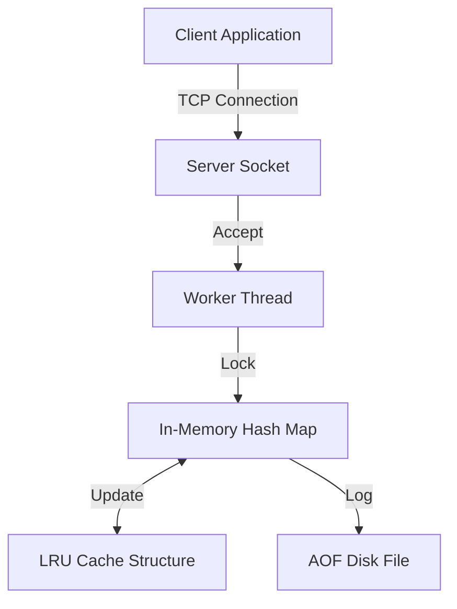

# AtomicKV: High-Performance Distributed Key-Value Store


---

AtomicKV is a persistent, multithreaded in-memory key-value database implemented in C++. It is designed to handle concurrent workloads using raw TCP sockets and POSIX threading, bypassing the overhead of higher-level protocols like HTTP.

The system features Append-Only File (AOF) persistence for crash recovery, an LRU eviction policy for memory management, and a custom application-layer protocol for client-server communication.

## Key Features

* **Raw TCP Networking**: Built directly on POSIX Sockets (`sys/socket`). Handles byte-stream parsing manually without relying on web frameworks.
* **Concurrency Control**: Implements a thread-per-client model using C++ standard threading. Data consistency is ensured via fine-grained mutex locking (`std::unique_lock` and `std::shared_lock`) to allow safe concurrent read/write access.
* **Data Persistence**: Features an Append-Only File (AOF) mechanism. Write operations are logged to disk asynchronously, ensuring data survives server restarts with minimal impact on write latency.
* **Memory Management**:
    * **LRU Cache**: Implements a Least Recently Used eviction policy using a combination of a Doubly Linked List and a Hash Map, ensuring O(1) time complexity for eviction and retrieval.
    * **Lazy Expiration**: Keys with Time-To-Live (TTL) values are evicted lazily upon access to reduce background CPU overhead.
* **Cloud Deployment**: The application is containerized using Docker and verified for production deployment on AWS EC2 instances with custom Security Group configurations.

## System Architecture

The server utilizes a multithreaded architecture. Upon accepting a connection, the main thread spawns a dedicated worker thread to handle the client's request lifecycle.

**Data Flow:**
1.  **Networking Layer:** Reads raw bytes from the socket and parses the custom protocol commands (SET, GET, DEL).
2.  **Engine Layer:** Acquires the necessary locks (Reader/Writer) on the central data store.
3.  **Storage Layer:** Updates the in-memory Hash Map and the LRU Tracker.
4.  **Persistence Layer:** Appends the write command to the AOF log file.



## Performance Benchmarks

To verify the throughput of the server, a custom Python benchmarking script was used to send sequential `SET` commands over a local TCP loopback interface.

**Test Conditions:**
* **Client:** Python script (Single-threaded, blocking I/O)
* **Protocol:** Raw TCP Sockets
* **Payload:** Sequential `SET` operations
* **Environment:** Linux (WSL2)

**Results:**

| Metric | Result |
| :--- | :--- |
| **Total Requests** | 10,000 |
| **Time Taken** | 1.03 seconds |
| **Throughput** | **9,683 Requests/Sec** |

> *Note: These results demonstrate the efficiency of the raw socket implementation. The server effectively handles ~9.6k transactions per second even when throttled by the synchronous nature of a single-threaded Python client.*

## Build and Usage

### Prerequisites
* C++ Compiler (g++ supporting C++17)
* Make
* Docker (Optional, for containerized run)

### Compilation
To compile the server from source:

```bash
make
```

### Running the Server
Start the server executable. It will listen on port 8080 by default.

```bash
./atomic_server
```

### Connecting via Client
You can interact with the server using netcat (nc) or Telnet.

```bash
nc localhost 8080
```

**Supported Commands:**
* `SET <key> <value>`: Store a string value.
* `SET <key> <value> <seconds>`: Store a string with a timeout.
* `GET <key>`: Retrieve a value.
* `DEL <key>`: Remove a key.

**Example Session:**
```bash
SET value1 active
OK
GET status
active
SET value2 10 20 #it will assign 10 to value2 and it will expire after 20 seconds
OK
```

## Deployment

### Docker
To run the application in a containerized environment, build the Docker image and run the container mapping the internal port 8080 to the host.

```bash
docker build -t atomickv .
docker run -d -p 8080:8080 
```

### AWS EC2
The project is configured to run on standard Linux instances (e.g., Ubuntu 22.04 LTS).

1.  **Provision Instance**: Launch an EC2 instance.
2.  **Configure Security Group**: Add a custom Inbound Rule to allow **TCP** traffic on port **8080** from your IP address (or 0.0.0.0/0 for public access).
3.  **Run Application**: Clone the repository on the instance, build using `make`, and start the server using `./atomic_server`.

## Project Structure

* `src/`: Contains the core implementation files.
    * `server.cpp`: Entry point handling TCP connections and thread management.
    * `kv_store.cpp`: Implementation of the thread-safe Key-Value store and O(1) LRU cache eviction policy.
* `include/`: Header files defining the system interface and class structure.
* `Dockerfile`: Instructions for building the Linux-based container image.
* `Makefile`: Automation script for compiling and linking the C++ source code.
* `benchmark.py`: Python script used for latency and throughput testing.
