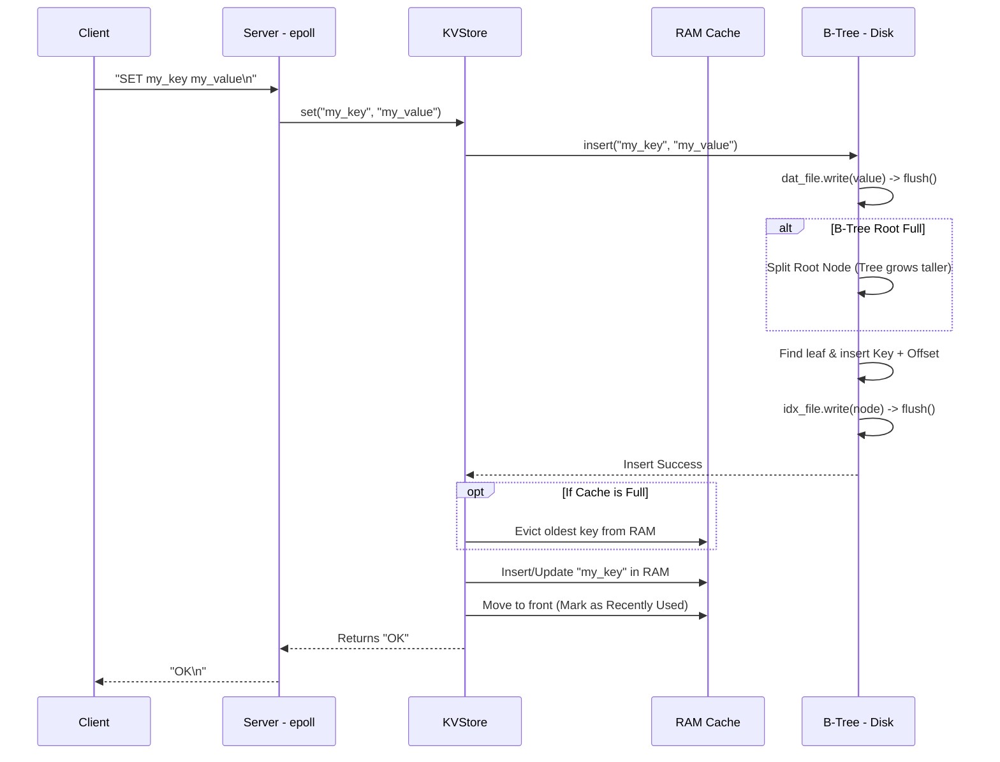
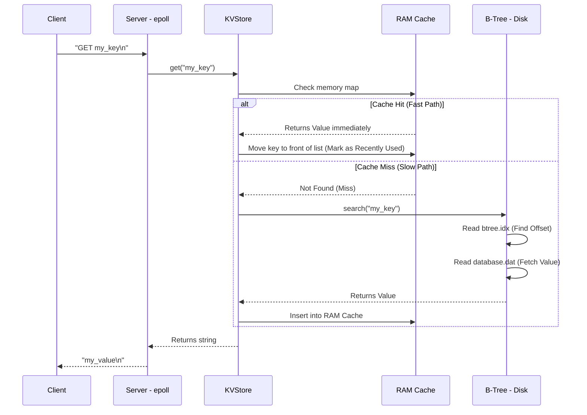
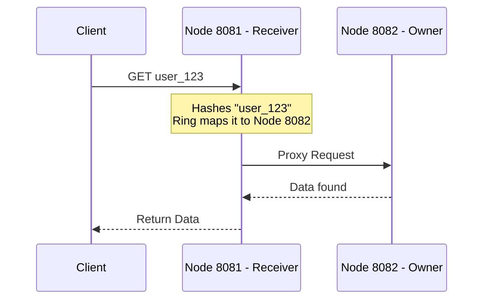
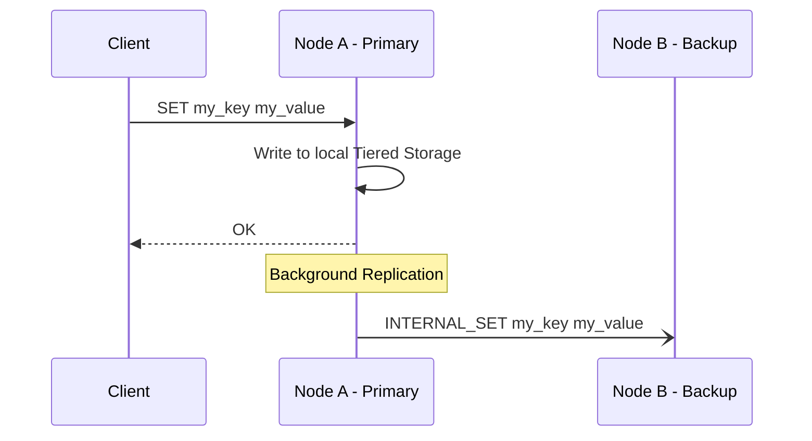
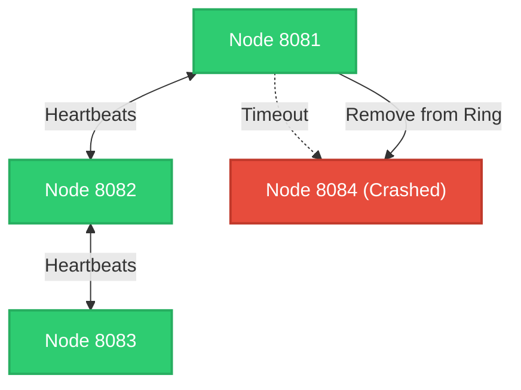

<div align="center">
  <h1>NitKVStore</h1>
  <p><b>A high-performance, fully distributed, tiered Key-Value store built from scratch in C++17.</b></p>
  <p>
    
    
    
    
  </p>
</div>

---

## Motivation
I built NitKVStore to deeply understand the internals of distributed databases like Redis and Cassandra. Reading academic papers wasn't enough, so I wanted to implement the core concepts—like non-blocking I/O, custom B-Trees, and eventual consistency—entirely from scratch. 

What started as a simple in-memory cache evolved into a distributed, fault-tolerant system capable of handling nearly 10,000 concurrent connections on a single thread. 

If you are reviewing this project, this document walks through the exact engineering journey, architectural decisions, and trade-offs made along the way.

---

## 1. The Core Engine: Solving C10k with `epoll`
The standard approach to building a server is spawning a new `std::thread` for every client. This works fine for 100 users, but crashes and burns at 10,000 users because the CPU spends more time context-switching between threads than actually processing data. 

NitKVStore abandons multithreading for its network layer. Instead, it uses Linux's **`epoll` API** combined with **non-blocking POSIX sockets (`fcntl`)**. A *single* main thread monitors thousands of sockets simultaneously. It only wakes up to process data when the OS kernel explicitly notifies it that a socket is ready for reading or writing, completely eliminating context-switching overhead.

---

## 2. The Storage Engine: LRU Cache & Custom B-Tree
NitKVStore isn't just a volatile cache; it is a tiered, persistent database. To achieve this, I built a two-layer storage engine.

### L1: The RAM Layer (LRU Cache & Bloom Filter)
For lightning-fast reads, data sits in a custom-built Least Recently Used (LRU) Cache. It uses a combination of a `std::unordered_map` and a doubly-linked list to achieve **`O(1)` time complexity** for both lookups and evictions. It also implements Lazy Expiration (TTL)—expired keys are cleaned up upon access rather than wasting CPU cycles on a background thread. 

Additionally, a **Bloom Filter** sits in front of the cache. If a client requests a key that doesn't exist, the Bloom Filter instantly returns a negative result, completely avoiding an expensive fallback read to the disk layer.

### L2: The Disk Layer (Order-3 B-Tree)
When the RAM fills up, data isn't lost. It falls back to a custom **Order-3 B-Tree** built entirely from scratch. 
To optimize disk I/O, keys and values are decoupled:
1. **`database.dat`**: The raw string values are simply appended to this file.
2. **`btree.idx`**: The B-Tree only stores the keys and the *byte-offsets* pointing to where the value lives in the `.dat` file. 

If a B-Tree node fills up, the tree dynamically splits the node and grows taller, maintaining `O(log N)` search times even on a spinning hard drive.

#### How a `SET` Request Works (Durability First)
Data is always written to disk before acknowledging the client to ensure crash recovery.


```mermaid
sequenceDiagram
    participant Client
    participant Epoll as Server - epoll
    participant KV as KVStore
    participant LRU as RAM Cache
    participant Disk as B-Tree - Disk

    Client->>Epoll: "SET my_key my_value\n"
    Epoll->>KV: set("my_key", "my_value")
    
    %% Write to Disk First (Durability)
    KV->>Disk: insert("my_key", "my_value")
    Disk->>Disk: dat_file.write(value) -> flush()
    
    alt B-Tree Root Full
        Disk->>Disk: Split Root Node (Tree grows taller)
    end
    
    Disk->>Disk: Find leaf & insert Key + Offset
    Disk->>Disk: idx_file.write(node) -> flush()
    Disk-->>KV: Insert Success
    
    %% Update RAM Cache
    opt If Cache is Full
        KV->>LRU: Evict oldest key from RAM
    end
    KV->>LRU: Insert/Update "my_key" in RAM
    KV->>LRU: Move to front (Mark as Recently Used)
    
    KV-->>Epoll: Returns "OK"
    Epoll-->>Client: "OK\n"
```

#### How a `GET` Request Works (Fast Path vs Slow Path)

```mermaid
sequenceDiagram
    participant Client
    participant Epoll as Server - epoll
    participant KV as KVStore
    participant LRU as RAM Cache
    participant Disk as B-Tree - Disk

    Client->>Epoll: "GET my_key\n"
    Epoll->>KV: get("my_key")
    
    %% RAM Check
    KV->>LRU: Check memory map
    
    alt Cache Hit (Fast Path)
        LRU-->>KV: Returns Value immediately
        KV->>LRU: Move key to front of list (Mark as Recently Used)
    else Cache Miss (Slow Path)
        LRU-->>KV: Not Found (Miss)
        
        %% Disk Check
        KV->>Disk: search("my_key")
        Disk->>Disk: Read btree.idx (Find Offset)
        Disk->>Disk: Read database.dat (Fetch Value)
        Disk-->>KV: Returns Value
        
        %% Bring to RAM
        KV->>LRU: Insert into RAM Cache
    end
    
    KV-->>Epoll: Returns string
    Epoll-->>Client: "my_value\n"
```

---

## 3. Scaling Out: The Distributed Journey
A single node is great, but real databases need to scale. Here is how NitKVStore evolved into a distributed system over three phases.

### Phase 1: Consistent Hashing Proxy
To distribute load without forcing the client application to map keys to specific servers, the nodes themselves do the routing. Using a **Consistent Hash Ring** with virtual nodes, any server can accept a request, hash the key, and route it to the correct owner node behind the scenes.


```mermaid
sequenceDiagram
    participant Client
    participant NodeA as Node 8081 - Receiver
    participant NodeB as Node 8082 - Owner

    Client->>NodeA: GET user_123
    Note over NodeA: Hashes "user_123"<br/>Ring maps it to Node 8082
    NodeA->>NodeB: Proxy Request
    NodeB-->>NodeA: Data found
    NodeA-->>Client: Return Data
```

### Phase 2: Asynchronous Replication (High Availability)
To handle node failures, data must be replicated. However, waiting for network calls to backup nodes blocks the main `epoll` thread. To fix this, NitKVStore embraces **Eventual Consistency**. The primary node saves the data locally, immediately returns `OK` to the client, and enqueues the write for an isolated background thread to asynchronously replicate to other nodes.


```mermaid
sequenceDiagram
    participant Client
    participant Primary as Node A - Primary
    participant Replica as Node B - Backup

    Client->>Primary: SET my_key my_value
    Primary->>Primary: Write to local Tiered Storage
    Primary-->>Client: OK
    
    Note over Primary: Background Replication
    Primary-)Replica: INTERNAL_SET my_key my_value
```

### Phase 3: Gossip Protocol & Failure Detection
How does the cluster know when a node dies without a central master server? **Gossip Protocol**. 
Every few seconds, a node randomly selects another node and whispers its state. If a node stops responding for a 10-second timeout, the cluster marks it as dead and automatically rebalances the Consistent Hash Ring.


```mermaid
graph TD
    classDef alive fill:#2ecc71,stroke:#27ae60,stroke-width:2px,color:white;
    classDef dead fill:#e74c3c,stroke:#c0392b,stroke-width:2px,color:white;

    Node1["Node 8081"]:::alive
    Node2["Node 8082"]:::alive
    Node3["Node 8083"]:::alive
    Node4["Node 8084 (Crashed)"]:::dead

    Node1 <-->|"Heartbeats"| Node2
    Node2 <-->|"Heartbeats"| Node3
    Node1 -.->|"Timeout"| Node4
    Node1 -->|"Remove from Ring"| Node4
```

---

## 4. Conflict Resolution (Eventual Consistency)
Because the system prioritizes High Availability (AP in the CAP theorem), data conflicts will inevitably occur.
* **Lamport Clocks:** Every write operation increments a logical clock. If two clients update the exact same key on different nodes simultaneously, the cluster uses the Lamport Clock to determine the "winner" (Last Write Wins).
* **Anti-Entropy & Merkle Trees:** Background workers continuously compare data between nodes to repair stale records. To avoid clogging the network, nodes build **Merkle Trees** of their data. They compare root hashes, and if they differ, they traverse the tree to find and exchange only the exact differing keys.

---

## 5. The Custom Wire Protocol
Instead of relying on heavy application-layer protocols like HTTP or gRPC, NitKVStore communicates over raw TCP using a custom, lightweight wire protocol. This minimizes bandwidth and parsing overhead.

The server expects newline-terminated (`\n`) ASCII commands.

**Packet Anatomy:**
* **`SET` Command:** `SET <key> <value> [TTL]\n`
  * *Example:* `SET session_token abc123 3600\n`
* **`GET` Command:** `GET <key>\n`
  * *Example:* `GET session_token\n`
* **Internal Cluster Commands:**
  * Background replication threads bypass the public API by sending internal commands like `INTERNAL_SET` to ensure replicas apply the exact Lamport timestamps generated by the primary node.

Because the socket is non-blocking, the server buffers incoming bytes into a per-client queue until a `\n` character is detected, at which point the full command is dispatched to the storage engine.

---

## Project Structure

* `src/server.cpp`: Main `epoll` loop, TCP handling, and protocol parsing.
* `src/kv_store.cpp`: Thread-safe Key-Value store and LRU cache logic.
* `src/btree.cpp`: Disk-persistence engine implementation.
* `include/`: Interface definitions.
* `benchmark.py`: Multithreaded Python script for stress-testing.

---

## Performance

The system was benchmarked using a custom Python script simulating concurrent clients to test the `epoll` architecture.

| Metric | Result |
| :--- | :--- |
| **Total Requests** | 80,000 |
| **Time Taken** | 8.04 seconds |
| **Throughput** | **~9,950 Requests/Sec** |
| **Average Latency** | **32.97 ms** (per SET + GET pair) |

Running on a standard Linux environment, the single-threaded server comfortably handles roughly 10,000 operations per second.

---

## Usage

### Prerequisites
* Linux environment (or WSL)
* `g++` (C++17) and `make`

### Build
```bash
make clean && make
```

### Run a Cluster
You can start multiple nodes to test the distributed features. Open separate terminals:

```bash
# Node 1
./nitredis_server 8081

# Node 2 (Joins via Node 1)
./nitredis_server 8082 127.0.0.1:8081

# Node 3 (Joins via Node 1)
./nitredis_server 8083 127.0.0.1:8081
```

### Client Connection
Connect using `nc` or `telnet`:

```bash
nc localhost 8081
```

**Commands:**
* `SET <key> <value>`
* `SET <key> <value> <seconds>` (with TTL)
* `GET <key>`
* `DEL <key>`

**Example:**
```bash
SET user_1 alice
OK

GET user_1
alice

SET temp_token 12345 10
OK
```

---

## Deployment

### Docker
```bash
docker build -t nitkvstore .
docker run -d -p 8081:8081 nitkvstore
```

### AWS EC2
Tested on Ubuntu 22.04 LTS. Ensure your Security Group allows inbound TCP traffic on port 8081. Clone the repository, compile with `make`, and run `./nitredis_server`.

---

## Try It Live

You can interact with a live, deployed instance of this key-value store directly from your terminal. No installation is required—just connect via TCP using `netcat`:

```bash
nc 100.53.37.203 8081
```

Once connected, you can immediately start sending database commands. 

**Example Interaction:**
```text    
> SET name Satyam
OK
> GET name
Satyam
> DEL name
OK
```
*(Press `Ctrl + C` to exit the connection when you are done).*

---

## What I Learned
This project was an exercise in understanding system-level programming. Implementing a B-Tree from scratch, working directly with the Linux kernel (`epoll`), and dealing with distributed consensus and lock-free structures provided a much deeper appreciation for production databases.
