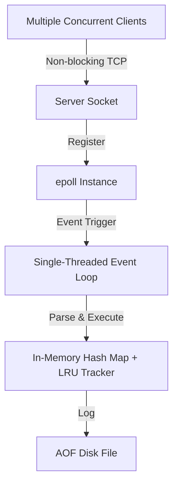

# AtomicKV: High-Performance Distributed Key-Value Store


---

AtomicKV is a high-performance, single-threaded, event-driven in-memory key-value database implemented in C++. It is engineered to handle massive concurrent workloads using Linux `epoll` and non-blocking POSIX sockets, effectively resolving the C10K problem by eliminating the context-switching overhead of traditional thread-per-client models.

The system features an O(1) LRU eviction policy, lazy expiration for memory management, Append-Only File (AOF) persistence for crash recovery, and a custom application-layer protocol for client-server communication.

## Key Features

* **Asynchronous Event Loop**: Transitioned from a blocking multithreaded architecture to a highly scalable single-threaded model using the Linux `epoll` API.
* **Non-Blocking I/O**: Built directly on POSIX Sockets (`sys/socket`) using `fcntl` to ensure the main server thread never blocks during network reads/writes, allowing it to multiplex thousands of connections simultaneously.
* **Memory Management**:
    * **LRU Cache**: Implements a Least Recently Used eviction policy using a combination of a Doubly Linked List and a Hash Map, ensuring O(1) time complexity for eviction and retrieval.
    * **Lazy Expiration (TTL)**: Keys with Time-To-Live values are evicted lazily upon access, entirely removing background thread CPU overhead for expired key cleanup.
* **Data Persistence**: Features an Append-Only File (AOF) mechanism. Write operations are logged to disk, ensuring data survives server restarts while maintaining high throughput.
* **Cloud Deployment**: The application is containerized using Docker and verified for production deployment on AWS EC2 instances.

## System Architecture

AtomicKV utilizes a highly optimized event-driven architecture, similar to production systems like Redis and Nginx. Instead of spawning a new thread for every client, a single main thread monitors an `epoll` instance.

**Data Flow:**
1.  **Event Notification:** The `epoll_wait` system call alerts the server when a socket (either a new connection or an existing client sending a command) is ready for I/O.
2.  **Networking Layer:** Reads raw bytes from the non-blocking socket and parses the custom protocol commands (SET, GET, DEL).
3.  **Storage Layer:** Updates the in-memory Hash Map and reorganizes the LRU Doubly Linked List pointers in constant time.
4.  **Persistence Layer:** Appends the command to the AOF log file.


```mermaid
graph TD
    Client[Multiple Concurrent Clients] -->|Non-blocking TCP| Server[Server Socket]
    Server -->|Register| Epoll[epoll Instance]
    Epoll -->|Event Trigger | Loop[Single-Threaded Event Loop]
    Loop -->|Parse & Execute| KVStore[In-Memory Hash Map + LRU Tracker]
    KVStore -->|Log| AOF[AOF Disk File]
```
## Performance Benchmarks

To verify the scalability of the `epoll` architecture, a custom concurrent Python benchmarking suite utilizing a `ThreadPoolExecutor` was used to load-test the server with thousands of interleaved commands.

**Test Conditions:**
* **Clients:** 200 Concurrent Connections
* **Payload:** 200 `SET` and `GET` operations per client (Total 80,000 requests)
* **Protocol:** Raw TCP Sockets
* **Environment:** Native Linux

**Results:**

| Metric | Result |
| :--- | :--- |
| **Total Requests** | 80,000 |
| **Time Taken** | 8.04 seconds |
| **Throughput** | **~9,950 Requests/Sec** |
| **Average Latency** | **32.97 ms** (per SET+GET pair) |

> *Note: These results demonstrate the massive throughput advantage of the `epoll` architecture. By eliminating `std::thread` creation and context-switching overhead, the server comfortably handles nearly 10k concurrent operations per second.*

## Build and Usage

### Prerequisites
* C++ Compiler (g++ supporting C++17)
* Make
* Linux Environment (Required for `sys/epoll.h`)
* Docker (Optional)

### Compilation
To compile the server from source:

```bash
make
```
### Running the Server
Start the server executable. It will listen on port **8081** by default.

```bash
./nitredis_server
./nitredis_server
```

### Connecting via Client
You can interact with the server using netcat (`nc`) or Telnet.

```bash
nc localhost 8081
```

**Supported Commands:**
* `SET <key> <value>`: Store a string value.
* `SET <key> <value> <seconds>`: Store a string with a timeout.
* `GET <key>`: Retrieve a value.
* `DEL <key>`: Remove a key.

**Example Session on client terminal:**
```bash
SET value1 96   #(sent request from client)
OK              #(received response from server)  
GET value1      #(sent request from client)
96              #(received response from server)  
SET value2 10 20 #it will assign 10 to value2 and it will expire after 20 seconds  #(sent request from client)
OK              #(response received from server)
GET value2
10

#after 20 seconds
GET value2
NULL           #(response from server as now this key has been deleted)
```

## Deployment

### Docker
To run the application in a containerized environment, build the Docker image and run the container mapping the internal port 8080 to the host.

```bash
docker build -t atomickv .
docker run -d -p 8081:8081 
```

### AWS EC2
The project is configured to run on standard Linux instances (e.g., Ubuntu 22.04 LTS).

1.  **Provision Instance**: Launch an EC2 instance.
2.  **Configure Security Group**: Add a custom Inbound Rule to allow **TCP** traffic on port **8080** from your IP address (or 0.0.0.0/0 for public access).
3.  **Run Application**: Clone the repository on the instance, build using `make`, and start the server using `./nitredis_server`.
3.  **Run Application**: Clone the repository on the instance, build using `make`, and start the server using `./nitredis_server`.

## Project Structure

* `src/`: Contains the core implementation files.
    * `server.cpp`: Entry point handling TCP connections and thread management.
    * `kv_store.cpp`: Implementation of the thread-safe Key-Value store and O(1) LRU cache eviction policy.
* `include/`: Header files defining the system interface and class structure.
* `Dockerfile`: Instructions for building the Linux-based container image.
* `Makefile`: Automation script for compiling and linking the C++ source code.
* `benchmark.py`: Python script used for latency and throughput testing.
